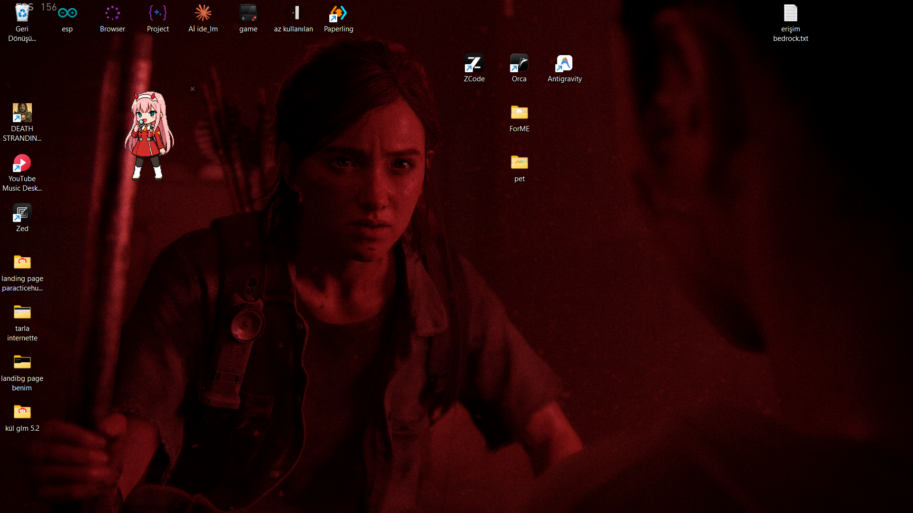
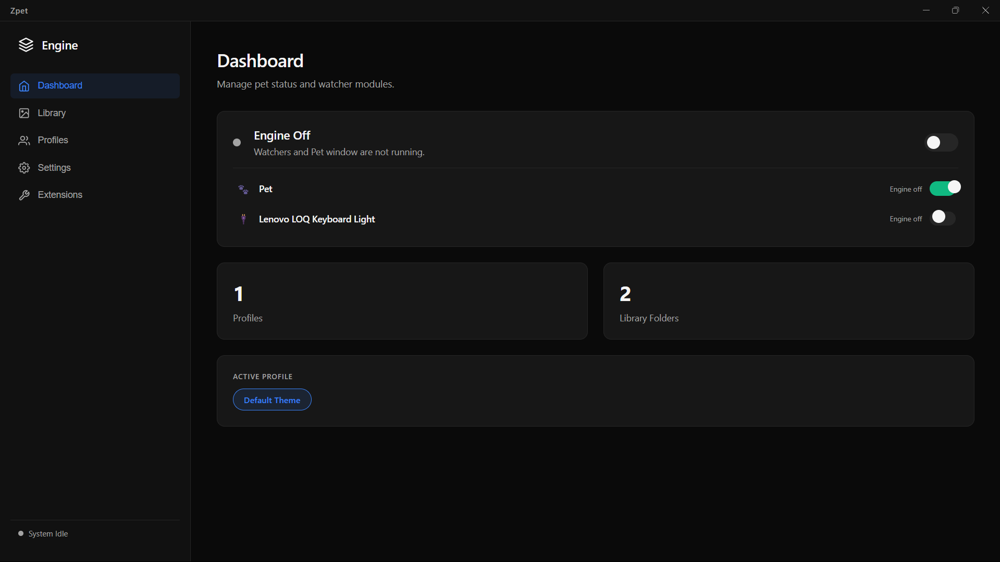
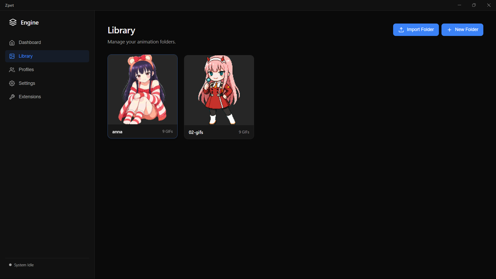
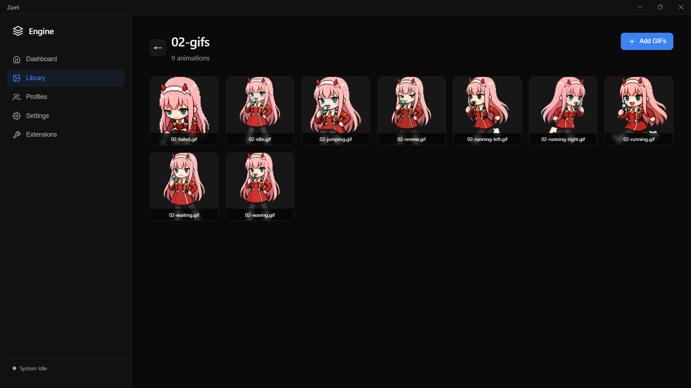
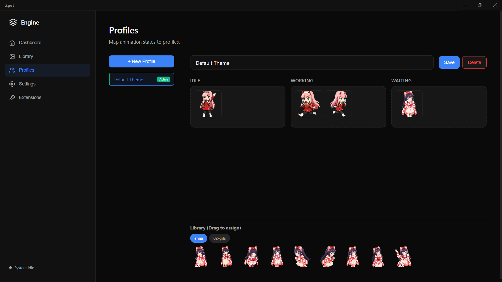
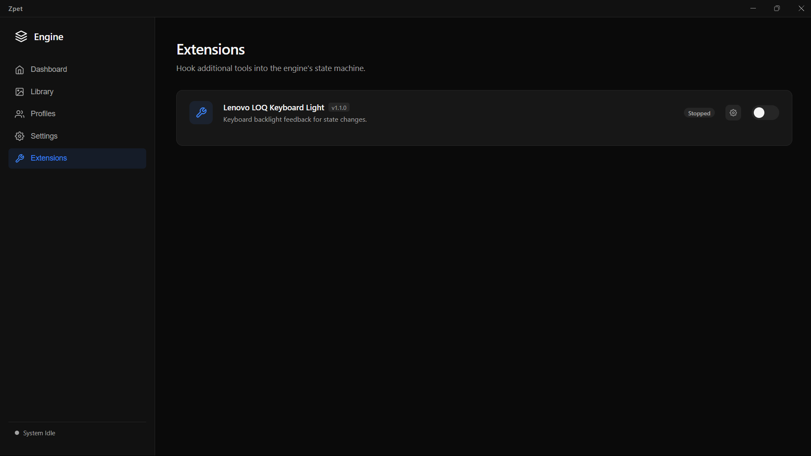

# Zpet

A desktop pet companion that reacts to your **Antigravity IDE** and **Antigravity CLI** activity in real time. Built with Electron, Zpet watches your Antigravity tools and animates a customizable pet overlay based on your current state — idle, working, or waiting.



## Features

- **Real-time activity detection** — Monitors Antigravity IDE and Antigravity CLI for file changes
- **Three pet states** — Idle, Working, and Waiting with smooth transitions
- **Custom GIF library** — Import and organize your own animations into folders
- **Profile system** — Create multiple profiles with different GIF sets per state
- **Extension system** — Hook custom tools into the state machine via plugins
- **Data export/import** — Backup and restore all your settings and library
- **Always-on-top overlay** — Transparent, draggable pet window
- **System tray** — Quick access and status at a glance
- **Onboarding wizard** — First-launch setup for new users

## Screenshots

### Dashboard
Control the engine, view stats, and switch profiles.



### Library
Organize your GIFs into folders. Import entire directories or add individual files.




### Profiles
Drag and drop GIFs from your library to assign them to pet states.



### Settings
Configure watcher paths and monitoring mode.


### Extensions
Install and manage plugins that react to state changes.



## Installation

### From Release
Download the latest installer from [Releases](https://github.com/carus10/Zpet/releases).

### From Source
```bash
git clone https://github.com/carus10/Zpet.git
cd Zpet
npm install
npm start
```

### Build
```bash
npm run build
```

## Compatibility

Zpet works exclusively with **Antigravity** tools:

| Tool | What it watches | Default path |
|------|----------------|--------------|
| **Antigravity IDE** | Conversation database files (`.db`, `.db-wal`, `.db-shm`) | `~/.gemini/antigravity-ide/conversations` |
| **Antigravity CLI** | Brain log files (`.jsonl`, `.json`) | `~/.gemini/antigravity-cli/brain` |

Both paths can be customized in **Settings > Watchers**. You can run IDE-only, CLI-only, or both simultaneously.

## How It Works

Zpet monitors file system changes in your Antigravity data directories:

1. **Antigravity IDE Watcher** — Watches conversation database files (`.db`, `.db-wal`, `.db-shm`) with both `fs.watch` and 300ms polling for reliability
2. **Antigravity CLI Watcher** — Watches brain log files (`.jsonl`, `.json`) and dynamically follows the most recently active session

**State transitions:**
- Activity detected → **Working**
- 2.5 seconds of silence → **Waiting**
- 10 seconds of silence → **Idle**

Multiple sources feed into a priority-based state machine — the highest priority state wins when multiple sources are active.

## Extensions

Zpet supports a plugin system. Extensions can react to state changes and integrate custom functionality.

### Installing Extensions from This Repo

1. Download or clone the extension folder from [`extensions/`](extensions/) in this repository
2. Copy it to your Zpet extensions folder:
   - **Windows:** `%APPDATA%/zpet/zpet_data/extensions/`
   - **macOS:** `~/Library/Application Support/zpet/zpet_data/extensions/`
   - **Linux:** `~/.config/zpet/zpet_data/extensions/`
3. Restart Zpet or toggle the extension in the Extensions tab

### Developing Extensions

See the [Extension Development Guide](extensions/DEVELOPMENT.md) for the full API reference.

**Quick start:**

```
extensions/
  my-extension/
    manifest.json
    main.js
```

**manifest.json:**
```json
{
  "id": "my-extension",
  "name": "My Extension",
  "version": "1.0.0",
  "description": "Description here",
  "author": "Your Name",
  "main": "main.js"
}
```

**main.js:**
```javascript
function activate(context) {
  context.log('Extension started!');
}

function onStateChange(newState, prevState) {
  // React to pet state changes
}

function deactivate() {}

module.exports = { activate, deactivate, onStateChange };
```

### Publishing Extensions

Submit a Pull Request adding your extension folder to the `extensions/` directory. Once merged, users can install it directly from this repository.

## Project Structure

```
Zpet/
├── src/
│   ├── main.js              # Electron main process
│   ├── preload.js           # Context bridge (IPC)
│   ├── stateMachine.js      # Multi-source state machine
│   ├── extensionManager.js  # Extension lifecycle manager
│   └── renderer/
│       ├── dashboard/       # Dashboard UI (HTML/CSS/JS)
│       └── pet/             # Pet overlay window
├── watchers/
│   ├── antigravity.js       # IDE file watcher
│   └── cliWatcher.js        # CLI file watcher
├── extensions/              # Community extensions (install from here)
│   ├── example-notifier/    # Example extension template
│   └── DEVELOPMENT.md       # Extension development guide
├── assets/                  # App assets (tray icon, screenshots)
├── config.js                # App configuration constants
└── package.json
```

## Configuration

On first launch, Zpet runs an onboarding wizard to configure:
- **Watch Mode** — IDE only, CLI only, or both
- **IDE Path** — Default: `~/.gemini/antigravity-ide/conversations`
- **CLI Path** — Default: `~/.gemini/antigravity-cli/brain`

These can be changed anytime in **Settings > Watchers**.

## Contributing

1. Fork the repository
2. Create your feature branch (`git checkout -b feature/amazing-feature`)
3. Commit your changes (`git commit -m 'Add amazing feature'`)
4. Push to the branch (`git push origin feature/amazing-feature`)
5. Open a Pull Request

### Contributing Extensions

Extensions live in the `extensions/` directory. To add a new extension:
1. Create a folder with your extension name
2. Include `manifest.json` and `main.js` (see [Development Guide](extensions/DEVELOPMENT.md))
3. Submit a PR — once merged, it's available for all users to install

## Requirements

- Node.js 18+
- Windows 10+ / macOS / Linux
- Electron 33+

## License

MIT
